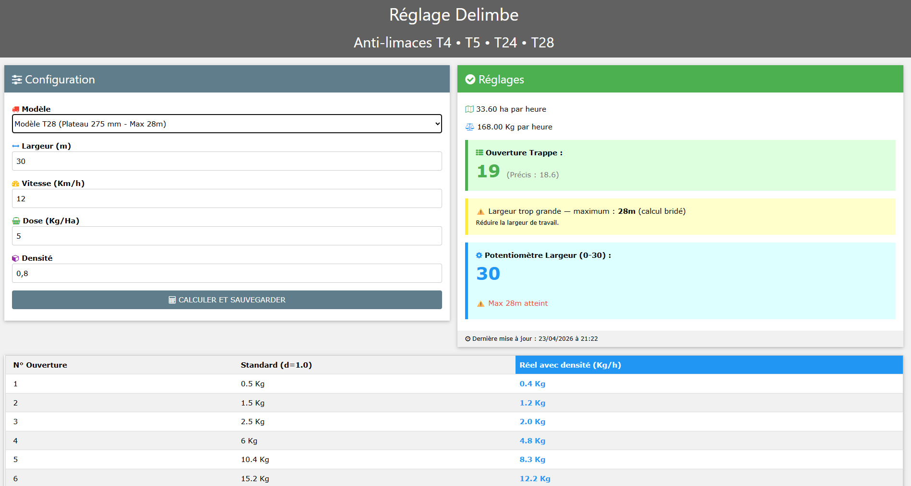

# Calculateur de Réglage Delimbe T24 & T28

  

[Version Française](#version-française) | [English Version](#english-version)

---

## Version Française

Outil de calcul de précision pour les épandeurs anti-limaces Delimbe modèles T24 et T28. 
Cette application web permet de déterminer rapidement l'ouverture de la trappe (mécanique) et la position du potentiomètre de largeur (électrique) en cabine.

### 🚀 Fonctionnalités
- **Sélection du modèle** : Supporte le T24 (max 24m) et le T28 (max 28m).
- **Calcul précis** : Détermine l'ouverture de trappe optimale selon la dose, la vitesse et la densité du produit.
- **Réglage du potentiomètre** : Calcule la graduation (0-30) pour la largeur de travail souhaitée (arrondi au chiffre supérieur pour garantir le recouvrement).
- **Sécurité anti-surdosage** : Bride automatiquement les calculs à la largeur réelle maximale de la machine si la saisie est hors limites.
- **Mémorisation** : Sauvegarde vos derniers réglages sur votre serveur pour une reprise rapide.

### 🛠️ Installation
1. Hébergez les fichiers `index.html`, `script.js`, `sauvegarde.php` et `w3.css` sur votre serveur FTP.
2. Assurez-vous que le fichier `reglages.json` possède les droits d'écriture (CHMOD 666 ou 777).
3. Ouvrez l'URL de votre serveur sur votre smartphone ou tablette en cabine.

### 📋 Licence
Ce projet est distribué sous licence **GNU GPL v3**. Vous êtes libre de l'utiliser, de le modifier et de le partager, à condition de conserver la même licence et de citer l'auteur original.

---

## English Version

Precision calibration tool for Delimbe slug pelted spreaders (T24 and T28 models).
This web application quickly calculates the optimal shutter opening (mechanical) and the width potentiometer position (electrical) from the tractor cabin.

### 🚀 Features
- **Model Selection**: Supports both T24 (max 24m) and T28 (max 28m) spreaders.
- **Precision Calculation**: Determines the best shutter opening based on dose, speed, and product density.
- **Potentiometer Setting**: Calculates the dial setting (0-30) for the desired working width (rounded up to ensure full coverage).
- **Overdose Safety**: Automatically caps calculations to the machine's real maximum width if the input exceeds physical limits.
- **Memory**: Saves your last settings on your server for quick resumption.

### 🛠️ Installation
1. Upload `index.html`, `script.js`, `sauvegarde.php`, and `w3.css` to your web server.
2. Ensure `reglages.json` has write permissions (CHMOD 666 or 777).
3. Open your server's URL on your smartphone or tablet while in the field.

### 📋 License
This project is distributed under the **GNU GPL v3** license. You are free to use, modify, and share it, provided you keep the same license and credit the original author.

---
*Développé pour simplifier le travail en plaine / Developed to simplify field operations.*
